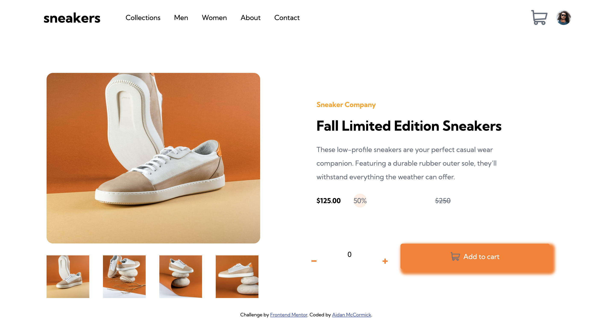

# Frontend Mentor - E-commerce product page solution

This is a solution to the [E-commerce product page challenge on Frontend Mentor](https://www.frontendmentor.io/challenges/ecommerce-product-page-UPsZ9MJp6). Frontend Mentor challenges help you improve your coding skills by building realistic projects.

### The challenge

Users should be able to:

- View the optimal layout for the site depending on their device's screen size
- See hover states for all interactive elements on the page
- Switch the large product image by clicking on the small thumbnail images
- Add items to the cart
- View the cart and remove items from it

### Screenshot

### Links

- Solution URL: [Add solution URL here](https://www.frontendmentor.io/solutions/responsive-checkout-paging-with-html-css-and-js-HbAGQp_U7j)
- Live Site URL: [Add live site URL here](https://amcc155.github.io/Frontend-ecomCheckout/ecommerce-product-page-main/)

## My process

### Built with

- Semantic HTML5 markup
- CSS custom properties
- Flexbox
- Mobile-first workflow

### What I learned
- Improved my skills on making repsonsive deigns.
- Taking a design someone else made, and coding it to replicate it the best I can

## Author

- Website - [Aidan McCormick](https://amcc155.github.io/portfolio1/)
- Frontend Mentor - [@amcc155](https://www.frontendmentor.io/profile/amcc155)

